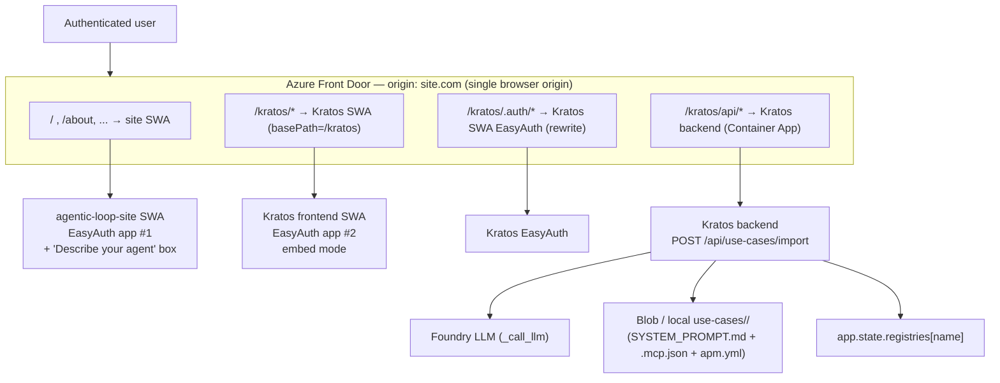

# Design Spec — Kratos Persona Import API + Embedded Hosting in agentic-loop-site

- **Date:** 2026-06-17
- **Status:** Design (approved direction, pre-implementation)
- **Primary repo:** `kmavrodis/kratos-agent` (this worktree) — implemented here
- **Secondary repo:** `aiappsgbb/agentic-loop-site` — separate PR / separate session
- **Related skill (contract compatibility only):** `aiappsgbb/threadlight-skills → threadlight-design`

---

## 1. Problem & Goal

`agentic-loop-site` should let an (authenticated) user **describe an agent in natural
language** and get a **real, working Kratos persona** generated for them — instead of
hand-authoring the three persona files. The site should also **host the Kratos UI as if
it were part of the site** (same origin, same "included" feel), **without copying any
Kratos files**, so that deploying the site always uses the latest Kratos code (no
duplication, no drift).

Two deliverables (two PRs):

1. **Kratos PR (this repo, primary):** a persona **Import API** + the frontend changes
   that make Kratos **mountable under a sub-path** and **embeddable** ("included" mode).
2. **agentic-loop-site PR (secondary):** a **"Describe your agent" generate box** + the
   **embedded mount** of Kratos + the **Front Door route** that path-mounts Kratos under
   the site origin.

The generated persona **contract must be compatible with `threadlight-design`** (its
`manifest.json` + `AGENTS.md` + skills shape) so the two ecosystems interoperate.

---

## 2. Locked-in Decisions (from clarification)

| # | Decision | Rationale |
|---|----------|-----------|
| D1 | **Two PRs**, Kratos primary (this worktree); site secondary (separate session — `~/Repos/agentic-loop-site` is a plain clone, not a worktree). | User directive. |
| D2 | **Generate box (UI) lives in the site**; **LLM generation runs in the Kratos backend** (the Import API), reusing Kratos's Foundry credentials. | Site has no backend/LLM; Kratos already has the Foundry wiring. |
| D3 | **Embedding = reverse-proxy / path-mount at deploy (Front Door)** under `site.com/kratos/*`. **Not** iframe, **not** module federation. | User picked §2; wants same-origin "included" feel + URL args; called federation "clumsy". |
| D4 | **No public/anonymous access.** Both the site SWA and Kratos SWA sit behind **Entra EasyAuth**. No demo mode, no ephemeral personas. | User directive. |
| D5 | **Different Entra app registrations** for site vs Kratos → entering `/kratos/*` triggers a **second EasyAuth round-trip** (silent if the browser already has an Entra IdP session; otherwise interactive). | User directive. Drives the basePath-aware `/.auth` work. |
| D6 | **Import endpoint is authenticated** (`require_authenticated_user`), consistent with all existing Kratos admin/export routes. | Security parity. |
| D7 | The site's generate box **hands NL into the embedded Kratos**, which performs the authenticated import — rather than the site calling the Kratos backend cross-origin. | Keeps every Kratos backend call inside Kratos's own auth/CORS/session context; lets EasyAuth do the work; survives D5. |
| D8 | Import contract is **threadlight-`manifest.json`-compatible** and **hybrid**: accepts a structured contract and/or a raw NL `prompt`; the LLM expands NL → contract → Kratos's 3 files. | User NOTE about threadlight compatibility. |

---

## 3. Background: how Kratos works today (verified)

**Persona = "use-case" = a folder** `use-cases/<name>/` containing:
- `SYSTEM_PROMPT.md` — YAML frontmatter (`name`, `description`, `sampleQuestions[]`,
  `curated`) + markdown body (the system prompt / agent instructions).
- `.mcp.json` — MCP server config (often `{}`).
- `apm.yml` — Agent Package Manager manifest (`dependencies.apm[]`, `dependencies.mcp[]`).

Personas are loaded at startup into `app.state.registries: dict[str, SkillRegistry]`
(keyed by use-case name); `app.state.skill_registry` defaults to `generic`. Stored in
Azure Blob Storage (prod) or local `use-cases/` (dev) via `BlobSkillService`.

**Backend** (FastAPI, `src/backend/app/`): routers mounted in `main.py`. All existing
admin routers operate on **existing** use-cases (404 if missing). **There is no
"create new persona" endpoint** — that is the net-new Import API.
- `routers/admin_analysis.py` has the reusable Foundry LLM helper
  `_call_llm(system_prompt, user_content, json_mode=)` — `DefaultAzureCredential` token
  for `https://cognitiveservices.azure.com/.default`, URL from `FOUNDRY_ENDPOINT` +
  `FOUNDRY_MODEL_DEPLOYMENT`, api-version `2024-12-01-preview`, supports
  `response_format={"type":"json_object"}`.
- `routers/export.py` is the existing **reverse** of import (use-case → deployable ZIP);
  source of the use-case **name regex** `^[a-z0-9][a-z0-9-]{0,63}$` and the auth pattern.
- `services/blob_skill_service.py` has `upload_file`, `upload_mcp_config`,
  `upload_apm_manifest`, `local_dir`, `seed_from_local`, `list_use_cases`,
  `is_available` — but **no atomic "create use-case + register"** method.

**Frontend** (`src/frontend/`, Next.js 14 static export):
- `next.config.js`: `output: "export"`, `trailingSlash: true`. **No client-side MSAL is
  actually used** — the `NEXT_PUBLIC_MSAL_*` env vars are declared but unreferenced.
- Auth is **Azure Static Web Apps EasyAuth**: `staticwebapp.config.json` gates `/api/*`
  to role `authenticated` and redirects `401 → /.auth/login/aad`; global headers set
  `X-Frame-Options: DENY` + a CSP (`frame-src 'self' …`).
- `src/lib/config.ts` resolves the backend URL at runtime: build env → `/config.json`
  (`window.__KRATOS_CONFIG__`) → **same-origin `""` fallback "behind a proxy"** → dev.
  `loadRuntimeConfig()` fetches the **absolute** path `/config.json`.
- `page.tsx` already holds the state we need for deep-linking: `selectedUseCase`,
  `landingInput`, `pendingMessage`.

**Deploy** (`azure.yaml`): `agent-service` = Container App (backend `/api/*`);
`kratos-agent` = Foundry hosted agent; `web` = **Azure Static Web App** (Free tier,
`dist: out`). A `web.predeploy` hook injects `out/config.json` with `apiUrl`. The
frontend's same-origin fallback means it works behind a proxy without a hardcoded URL.

> **Implication for embedding:** because both the site and Kratos frontends are SWAs and
> SWA cannot reverse-proxy another SWA for non-`/api` routes, a true path-mount needs a
> proxy in front → **Azure Front Door** (D3). The Next.js static export must serve under a
> sub-path → **`basePath`/`assetPrefix`** (Workstream B). EasyAuth `/.auth/*` must also be
> reachable under the sub-path (D5).

---

## 4. Architecture Overview



**End-to-end flow (generate a persona):**

1. User is on `site.com` (already authenticated to site EasyAuth app #1).
2. User types a description into the **generate box** and submits. The site **stashes the
   NL prompt in `sessionStorage['kratos.generate']`** (see §7.1) and navigates (top-level)
   to `site.com/kratos/?embed=1&theme=<t>&generate=1`.
3. Front Door routes `/kratos/*` → Kratos SWA. Kratos EasyAuth (app #2) authenticates —
   **silent** if the Entra IdP session already exists in the browser, otherwise a prompt.
   The handoff payload **survives this redirect** because `sessionStorage` is shared across
   the single `site.com` origin (storage is per-origin, not per-path — both backend SWAs are
   invisible to the browser).
4. Embedded Kratos (chromeless) sees `?generate=1`, **reads-and-clears** the handoff payload
   from `sessionStorage` (so a refresh won't regenerate), then calls
   `POST /kratos/api/use-cases/import` with the NL — authenticated by the EasyAuth cookie,
   **same-origin** (no CORS), API base resolved by `config.ts`'s same-origin proxy fallback.
5. Import API: LLM expands NL → threadlight-compatible **contract** → maps to the three
   Kratos files → persists (blob/local) → registers `app.state.registries[name]` →
   `201 {name, displayName}`. On the NL path the slug is **auto-deduped** (`-2`, `-3`, …) so
   generation never dead-ends on a name clash; an explicit `contract.name` clash returns
   `409` (unless `overwrite`).
6. Kratos sets `selectedUseCase = name`, surfaces the persona's `sampleQuestions`, and opens
   the chat — the user is now talking to their generated agent, visually "inside" the site.
   On `422`/`409`/network error, embed mode shows an inline "couldn't generate — try again /
   edit" affordance instead of the chat.

---

## 5. Workstream A — Persona Import API (Kratos backend, net-new)

### 5.1 Endpoint
- `POST /api/use-cases/import` — new router `src/backend/app/routers/import_persona.py`,
  mounted in `main.py` under the `/api/use-cases` prefix (alongside `use_cases` / `export`).
- **Auth-gated** with the same `require_authenticated_user` dependency used by `export.py`.
- Returns `201` with `{ name, displayName, files: {...}, created: true }`. Name-collision
  policy: on the **NL path** (no explicit `contract.name`) the derived slug is
  **auto-deduped** (`name-2`, `name-3`, …) so generation never dead-ends; with an **explicit
  `contract.name`** a clash returns `409` unless `?overwrite=true`. `422` on invalid
  contract or malformed LLM output.

### 5.2 Request contract (hybrid; threadlight-compatible)
Accepts **either** a structured contract, **or** a raw `prompt`, **or** both (the contract
provides hints, the LLM fills the gaps):

```jsonc
{
  // --- Option 1: natural language (LLM expands) ---
  "prompt": "An assistant for retail-bank dispute handling that ...",

  // --- Option 2 / hints: threadlight-manifest-compatible structured contract ---
  "contract": {
    "name": "dispute-handler",                 // optional; LLM/slug derives if absent
    "description": "...",                       // ↔ SYSTEM_PROMPT frontmatter.description
    "sampleQuestions": ["...", "..."],          // ↔ SYSTEM_PROMPT frontmatter.sampleQuestions
    "instructions": "## Role ...",              // ↔ SYSTEM_PROMPT.md markdown body (AGENTS.md-like)
    "skills": [ { "name": "...", "description": "..." } ], // ↔ apm.yml dependencies.apm[]
    "mcpServers": { /* MCP contract */ },       // ↔ .mcp.json
    "tools": [ /* abstract tool contracts */ ], // ↔ apm.yml dependencies.mcp[] / .mcp.json
    "traits": ["..."],                          // carried as metadata (round-trip)
    "workflow_model": "agent"                   // Kratos personas are agent-shaped
  },
  "options": { "curated": false, "overwrite": false }
}
```

### 5.3 LLM behavior (reuse `admin_analysis._call_llm`)
- If `prompt` is present, call the Foundry LLM in **JSON mode** with a system prompt that
  instructs it to emit the **threadlight-compatible contract** above (validated against a
  Pydantic model). Merge any caller-supplied `contract` hints (caller hints win on
  conflicts; LLM fills the rest).
- Deterministic, non-LLM fallback: if no `prompt` and a complete `contract` is supplied,
  skip the LLM and map directly.

### 5.4 Mapping: contract → Kratos's 3 files
| Contract field | Kratos file |
|---|---|
| `name` | folder name `use-cases/<name>/` (slugified, validated `^[a-z0-9][a-z0-9-]{0,63}$`) |
| `description`, `sampleQuestions`, `curated` | `SYSTEM_PROMPT.md` **frontmatter** |
| `instructions` | `SYSTEM_PROMPT.md` **markdown body** |
| `mcpServers` / `tools` | `.mcp.json` (default `{}` when none) |
| `skills`, `tools` | `apm.yml` (`dependencies.apm[]`, `dependencies.mcp[]`) |
| `traits`, `workflow_model`, source metadata | `apm.yml` metadata block (for round-trip) |

### 5.5 Persistence + registration (new service method)
- Add `BlobSkillService.create_use_case(name, system_prompt_md, mcp_json, apm_yml,
  *, overwrite=False) -> CreatedUseCase` that writes all three files **atomically**
  (blob if `is_available`, else local `use-cases/<name>/…`, mirroring `admin_prompt.py`'s
  blob-vs-local pattern) and refuses to clobber unless `overwrite`.
- After write, **register in the live registry**: build a `SkillRegistry` for the new
  use-case and insert into `app.state.registries[name]` so it is immediately listable
  (`GET /api/use-cases`) and selectable without a restart.

### 5.6 Tests
- Unit: contract→files mapping (golden), slug/validation, overwrite/409, auth 401.
- Unit: LLM path mocked (assert `_call_llm` called with JSON mode; malformed JSON → 422).
- Integration: import → `GET /api/use-cases` includes the new persona → chat selectable.

---

## 6. Workstream B — Sub-path hosting (Kratos frontend + infra)

### 6.1 Next.js basePath / assetPrefix (env-driven, default off)
- `next.config.js`: read `NEXT_PUBLIC_BASE_PATH` (default `""`); when set (e.g. `/kratos`),
  set `basePath` and `assetPrefix` so all routes + `_next/*` assets live under the prefix.
  Local/standalone Kratos deploy stays unchanged (empty basePath).

### 6.2 basePath-aware runtime config
- `src/lib/config.ts`: `loadRuntimeConfig()` must fetch `${basePath}/config.json` (not the
  absolute `/config.json`), so the runtime API config resolves under the mount.
- `azure.yaml` `web.predeploy` hook writes `out/config.json` — confirm it lands at the
  basePath location in the export (Next emits under `out/` honoring basePath; verify path).
- The existing **same-origin `""` API fallback** is retained: under the mount, the
  frontend calls `/kratos/api/*` same-origin (no hardcoded backend host needed), which
  Front Door routes to the Kratos backend.

### 6.3 EasyAuth under the sub-path (D5)
- `staticwebapp.config.json`: make the `401` redirect **basePath-aware**
  (`${basePath}/.auth/login/aad`) and ensure `/api/*` (→ `/kratos/api/*` at the edge) keeps
  `allowedRoles: ["authenticated"]`.
- `X-Frame-Options: DENY` and the CSP **stay as-is** — path-mount is top-level navigation,
  not framing, so no relaxation is needed (a security win vs the iframe alternative).
- Front Door must route **`/kratos/.auth/*` → Kratos SWA `/.auth/*`** (prefix rewrite) so
  the second EasyAuth round-trip completes under the mounted origin.

### 6.4 Front Door (where it lives)
- The Front Door profile + routes (`/kratos/*`, `/kratos/.auth/*`, `/kratos/api/*`, default
  `/* → site`) are **infra that fronts both apps**. Primary placement: the **site PR**
  (it owns the composed origin), with this spec documenting the exact route/rewrite rules.
  Kratos's repo contributes only the basePath-aware SWA config + the `NEXT_PUBLIC_BASE_PATH`
  build wiring so the Kratos SWA is *mountable*. (If we later want Kratos to be
  self-mounting, an optional `infra/modules/front-door.bicep` can be added to Kratos — out
  of scope for this PR.)

---

## 7. Workstream C — Embed / "included" mode (Kratos frontend)

URL arguments (read in `page.tsx` via `useSearchParams`):

| Param | Effect |
|---|---|
| `embed=1` | **Chromeless** layout: hide the standalone sidebar/header chrome so the site's own chrome wraps Kratos; tighten paddings to blend in. |
| `theme=light\|dark` | Apply theme to match the host site (Tailwind `dark` class / data-attr). |
| `persona=<name>` | Preselect `selectedUseCase` (skip if not found). |
| `prompt=<text>` | Prefill `landingInput`. |
| `generate=1` (or `generate=<short NL>`) | After auth, read the NL handoff (§7.1), **read-and-clear** it, **auto-invoke** `POST /kratos/api/use-cases/import`, then select + open the created persona. |

- Add a small `useEmbed()` hook + an `embed`-aware wrapper around the existing layout; no
  changes to standalone behavior when params are absent.
- "Same look and feel": embed mode is chromeless and theme-synced; the site provides the
  surrounding frame/nav. (We are **not** restyling Kratos to the site's design system —
  that would be heavy and brittle; chromeless + theme sync is the pragmatic "included"
  feel the user asked for.)

### 7.1 The `generate=` handoff (same-origin sessionStorage relay)

The NL prompt is **not** stuffed into the query string (URL length limits, prompt leaking
into browser history/edge logs, fragility across the EasyAuth redirect). Instead:

- Under Front Door, `/` and `/kratos/*` are **one browser origin** (`site.com`), so
  `sessionStorage` is **shared** (web storage is keyed by origin, not path; the two backend
  SWAs are invisible to the browser). The site writes
  `sessionStorage.setItem('kratos.generate', JSON.stringify({ nl, theme?, persona?, prompt?, nonce }))`
  and navigates to `/kratos/?embed=1&generate=1`.
- The payload **survives the second EasyAuth round-trip** (same origin), so the design no
  longer depends on EasyAuth preserving the `post_login_redirect_uri` query string.
- Kratos embed mode **reads the payload once and removes it** (`removeItem`) before invoking
  import, so a page refresh cannot re-trigger generation.
- **Fallback for short prompts / no-relay contexts:** `generate=<url-encoded NL>` is still
  accepted; if `generate` is a non-`1` value, treat it as the literal NL. If `generate=1`
  but the relay payload is missing (e.g. opened directly), embed mode shows the normal
  landing input instead of erroring.
- This relay lives in the **site PR**; the Kratos PR only **consumes** `sessionStorage`
  `['kratos.generate']` + the `generate` param. Standalone Kratos ignores both.

---

## 8. Secondary PR — agentic-loop-site (separate session)

Captured here for completeness; **implemented in a separate session/worktree**, not this one.

- Replace the **mock** Kratos integration (`src/pages/Kratos.tsx`,
  `src/components/KratosChatMock.tsx`, `src/data/kratos.ts` `mockKratosReply`) with:
  - a **"Describe your agent" generate box** (can reuse the `GreenfieldBuilder` /
    `advisor.ts` "Make it real" pattern, repurposed to persona intent), and
  - an **embedded mount** that writes the NL to `sessionStorage['kratos.generate']` (§7.1)
    and navigates to `/kratos/?embed=1&theme=<t>&generate=1`.
- Add the **Front Door** profile + routes that path-mount Kratos under `/kratos/*`
  (per §6.3–6.4), including `/kratos/.auth/*` and `/kratos/api/*`.
- No Kratos files are copied — the mount serves the live Kratos SWA.

---

## 9. threadlight-design contract compatibility

The Import API's `contract` is a **subset/superset of threadlight's machine-readable
contract** so personas round-trip between ecosystems:

| threadlight artifact | threadlight field | Kratos Import `contract` | Kratos file |
|---|---|---|---|
| `specs/manifest.json` | `name`, `description` | `name`, `description` | `SYSTEM_PROMPT.md` frontmatter |
| `AGENTS.md` | agent identity / behavior body | `instructions` | `SYSTEM_PROMPT.md` body |
| `specs/manifest.json` | `skills[]` (`name`, `implements`) | `skills[]` | `apm.yml` `dependencies.apm[]` |
| SPEC §5b / §6 | MCP contract / tool contracts | `mcpServers`, `tools` | `.mcp.json`, `apm.yml` `dependencies.mcp[]` |
| `specs/manifest.json` | `traits[]` | `traits[]` | `apm.yml` metadata |
| SPEC §11e | `workflow_model: agent\|workflow` | `workflow_model` (Kratos supports `agent`) | `apm.yml` metadata |
| SKILL.md frontmatter | `name`, `description` (USE FOR / DO NOT USE FOR) | per-skill `name`/`description` | (future) Kratos skill files |

- Kratos personas map to threadlight's **`agent`** workflow shape; `workflow` is recorded
  as metadata but not executed by Kratos (out of scope).
- A future enhancement (not this PR) could accept a threadlight `manifest.json` directly
  and/or have Kratos `export.py` emit a threadlight-compatible `manifest.json` for full
  round-trip.

---

## 10. Auth & SSO topology (consequences of D4 + D5)

- One **browser origin** (`site.com`) via Front Door; **two SWAs**, each with its **own**
  EasyAuth/Entra app registration.
- EasyAuth cookies are host-scoped; with path-routing, `/.auth/*` can only point at one
  backend per path — hence the dedicated **`/kratos/.auth/*` → Kratos SWA** rewrite.
- The second login at `/kratos/*` is a redirect round-trip; **silent** when the user
  already has an Entra IdP session in the browser (common, since they just logged into the
  site), otherwise interactive. Documented as expected behavior, not a bug.
- The Import API trusts the Kratos SWA EasyAuth principal (existing
  `require_authenticated_user`); no new auth surface is introduced.

---

## 11. Risks & open questions

| Risk / question | Disposition |
|---|---|
| Front Door `/kratos/.auth/*` rewrite correctness (EasyAuth redirect URIs must resolve under the mount) | Validate during site-PR infra work; the Entra app #2 redirect URIs must include the Front Door origin under `/kratos/.auth/login/aad/callback`. |
| Next.js `basePath` + `trailingSlash` + static export edge cases for `_next/*` and `config.json` placement | Verify `out/` layout after `next build`; add a smoke check. |
| Second login could drop the `generate` payload if it relied on EasyAuth query preservation | **Mitigated** by the same-origin `sessionStorage` relay (§7.1) — the payload is independent of the redirect URL; read-and-cleared after use. |
| CORS: under the mount, frontend calls `/kratos/api/*` **same-origin** (no CORS); direct cross-origin calls avoided by D7. | Keep Kratos `_cors_origins` unchanged for standalone use. |
| `GreenfieldBuilder`/`advisor.ts` is app-scaffolding-shaped, not persona-shaped | Site PR repurposes the box to persona intent; deterministic contract optional, NL is primary. |
| Cost/complexity of Front Door | Accepted (D3); the lower-effort iframe alt was rejected as "clumsy". |

---

## 12. Change inventory

**Kratos PR (this repo):**
- `src/backend/app/routers/import_persona.py` — **new** router (`POST /api/use-cases/import`).
- `src/backend/app/main.py` — mount the new router.
- `src/backend/app/services/blob_skill_service.py` — **new** `create_use_case(...)` (atomic write + registry registration helper).
- `src/backend/app/models/…` — Pydantic models for the import contract.
- `src/frontend/next.config.js` — `NEXT_PUBLIC_BASE_PATH` → `basePath`/`assetPrefix`.
- `src/frontend/src/lib/config.ts` — basePath-aware `/config.json` fetch.
- `src/frontend/staticwebapp.config.json` — basePath-aware `401` redirect.
- `src/frontend/src/app/page.tsx` (+ small `useEmbed`/`useSearchParams` hook + chromeless wrapper) — embed/theme/persona/prompt/generate URL args.
- `azure.yaml` — confirm `config.json` injection path under basePath.
- Tests for the import mapping + endpoint.
- This spec; session `plan.md`.

**agentic-loop-site PR (separate session):**
- Replace mock Kratos with generate box + embedded mount (`?embed=1&generate=…`).
- Front Door profile + routes (`/kratos/*`, `/kratos/.auth/*`, `/kratos/api/*`, default → site).

---

## 13. Out of scope (this iteration)
- Restyling Kratos to the site's full design system (we do chromeless + theme sync only).
- threadlight `workflow`-shaped personas (Kratos runs `agent`-shaped only).
- Full bidirectional round-trip (Kratos `export.py` emitting threadlight `manifest.json`).
- Anonymous/demo mode, ephemeral personas (explicitly rejected by D4).
- A self-mounting Front Door module inside the Kratos repo (lives in the site PR).
